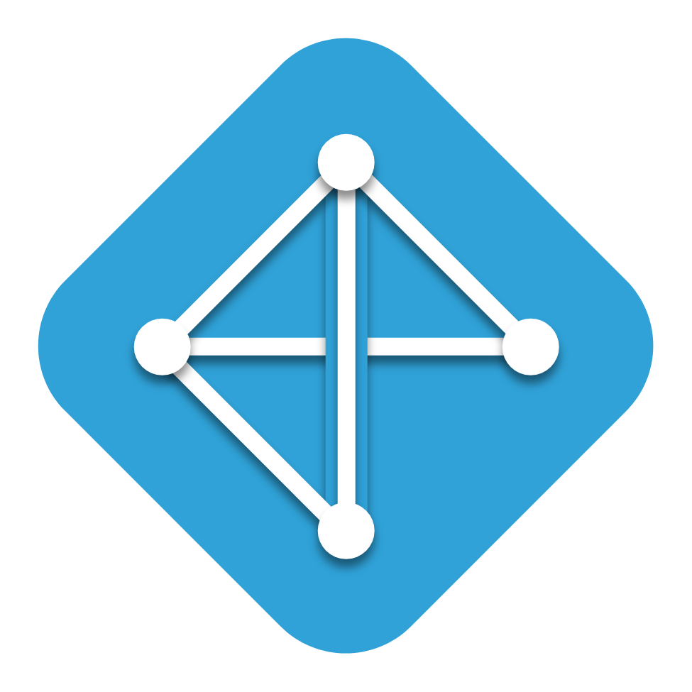

<h1>ACM BMU Website &nbsp;   &nbsp; </h1>

---

This is a Website for <b>ACM</b> club at <b>BMU</b>.

#### Note

> To add new events and workshops create a <b style="background-color: green;color:white;padding-left:10px;padding-right:10px;border-radius: 10px;padding-top:1px;padding-bottom: 2px">Pull request</b>. <br>
> The Website is still in development feel free to contribute. <br>
> It will be hosted shortly.

### Contribution

- <b>BMU Club Members</b>
    - Discuss in the ACM Group.
    - Create a pull request.
    - If needed get added to the contributor list.

- <b>Others</b>
    - Create an Issue. <br>
    - If the issue is assigned to you, work on the problem and create a pull request.

#### To clone this repository
```
$ git clone https://github.com/reach-the-sky/ACM-Website.git
```

<b>ACM BMU Github:</b> [ACM BMU Chapters](https://github.com/orgs/ACM-BMU-Chapter/dashboard)

<b>If you liked this project and appreciate the content we opensource, consider following on [Github 🌥](https://github.com/reach-the-sky).</b>
